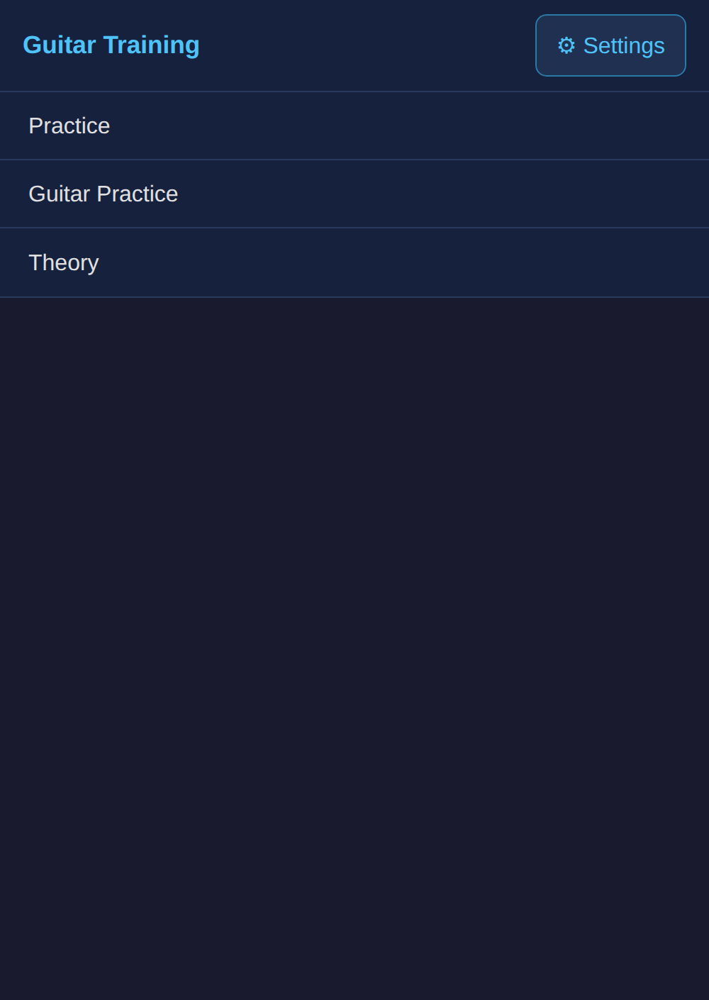
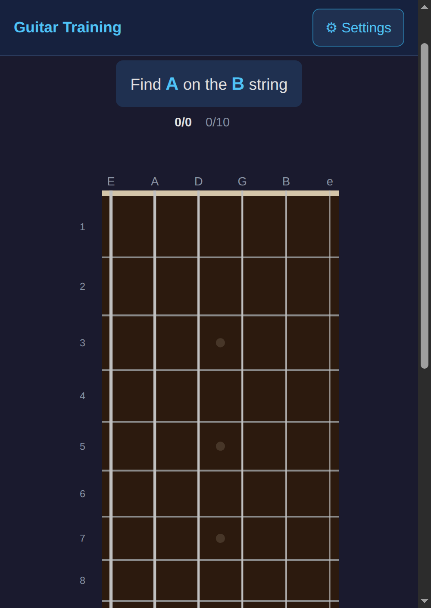
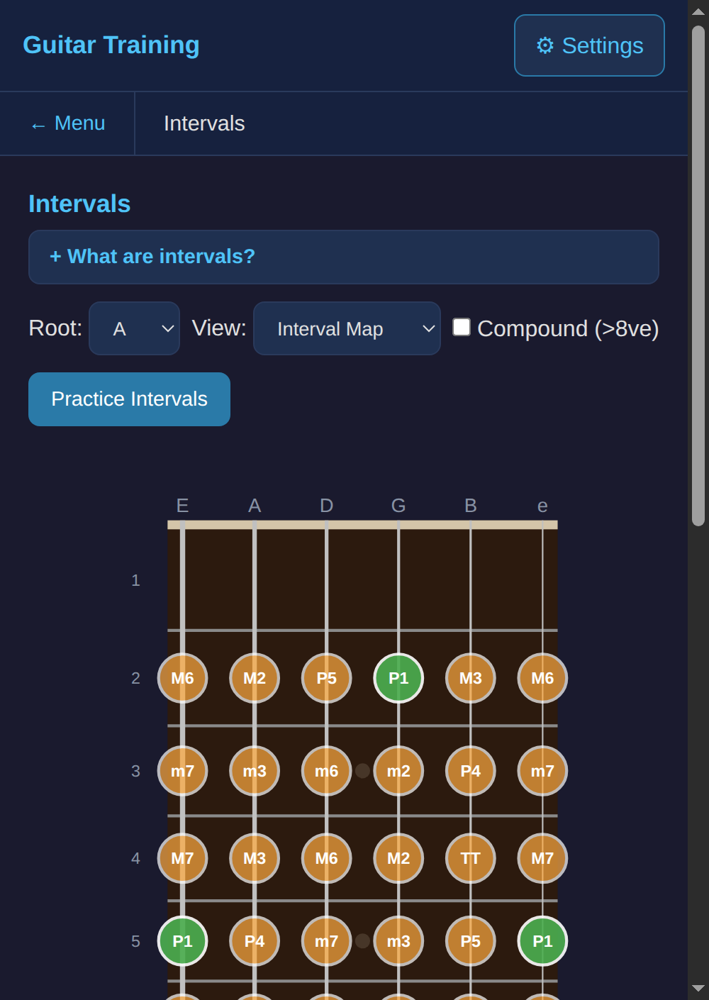
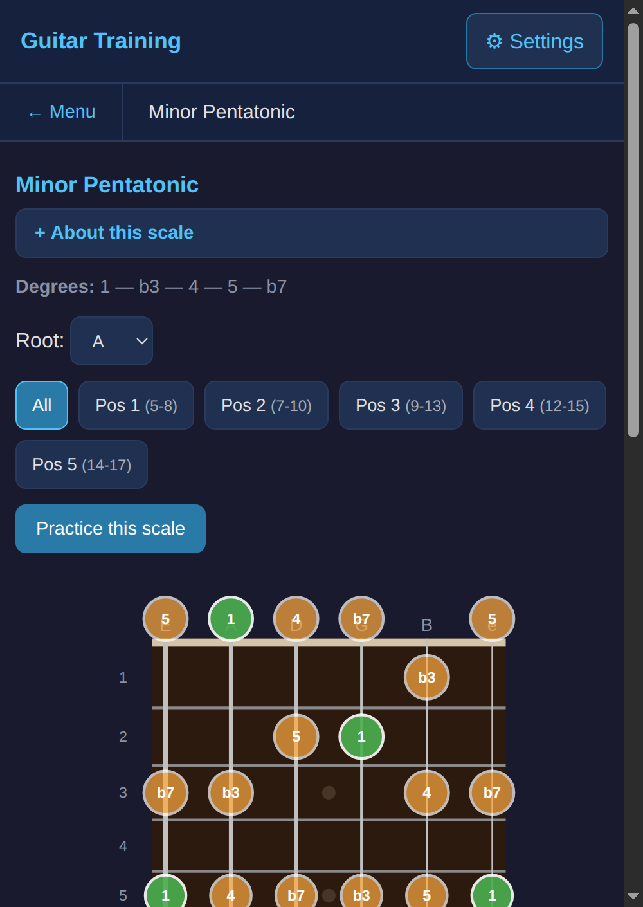
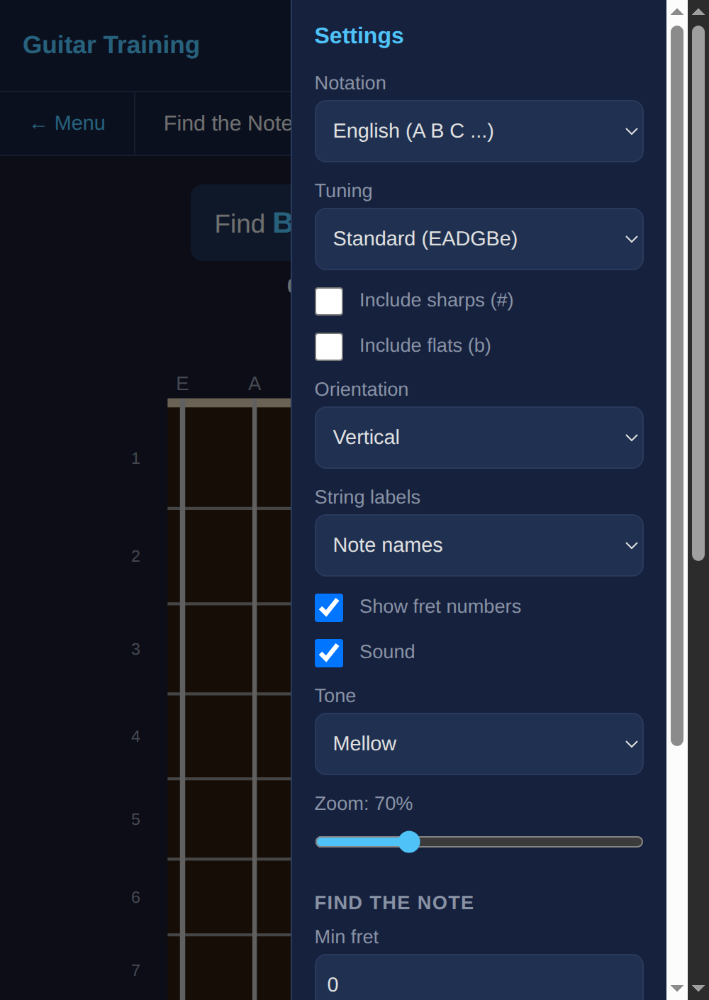

# Open Guitar Practice

An offline-first guitar learning studio for iPhone and the web. It combines fretboard recall, modes, chords, functional ear training, melodic memory, rhythm construction, and free play in one progressive curriculum.

## Screenshots

| Main Menu | Find the Note | Interval Map | Pentatonic Positions | Settings |
|:---------:|:-------------:|:------------:|:-------------------:|:--------:|
|  |  |  |  |  |

## What's Inside

### Practice Modes

- **Find the Note** — locate prompted notes across a chosen pool of strings, including single-string drills and optional accidentals.
- **Scale Degree Finder** — find roots, chord tones, characteristic modal tones, and eventually every degree across the neck.
- **Scale Journeys** — generated three-notes-per-string patterns plus seconds, thirds, fourths, cells, ascending/descending, and one-string traversal.
- **Chord Builder** — identify diatonic chord qualities and Roman numerals in all seven modes.
- **Ear Training** — tonic-context scale-degree recognition with adaptive sampling, spaced review, and progressive level unlocks.
- **Melody Memory** — transcribe short stepwise calls, leaps, major/minor phrases, and longer modal sequences.
- **Rhythm Lab** — hear, isolate, copy, recall, and build classic rock and metal grooves using kick, snare, and hi-hat pads.
- **Two-octave Piano** — a movable clean-reference keyboard with optional note labels.
- **Classic drills** — interval finding, timed guitar flashcards, all-occurrences note finding, and scale-position practice.

### Theory Reference

- **Modes and chords** — concise explanations of triad construction, diatonic chord sequences, relative/parallel modes, characteristic degrees, and generated chord diagrams for open, barre, CAGED, and diminished shapes.
- **Seven diatonic modes** — Ionian through Locrian, expressed as alterations of major or natural minor and tied directly to fretboard exercises.
- **Intervals and scale maps** — interactive major, minor, pentatonic, CAGED, and 3NPS fretboard references.

Each theory page links directly to a related practice exercise.

### Features

- Guided Today screen, learning paths, XP, streaks, mastery, and persistent progress
- Configurable clean or distorted guitar tone, drive, and master volume
- SVG fretboard with real guitar fret spacing ratio
- Vertical and horizontal orientation
- Web Audio guitar, piano/reference tones, chords, sequences, and synthesized drums
- 3 notation systems: English (A B C), Russian (До Ре Ми), Latin (Do Re Mi)
- Toggleable sharps/flats, note labels, string numbering, and fret numbers
- Configurable mode pool used by randomized scale practice
- Zoom slider for fitting any screen size
- All settings saved to localStorage
- PWA with offline support — all exercises work without a server
- Native iOS wrapper with safe-area-aware, one-handed navigation
- Modern dark interface designed around short, focused sessions

## Installation

### Docker (recommended)

```bash
git clone https://github.com/stas-polukeev/OpenGuitarPractice.git
cd OpenGuitarPractice
docker compose up -d
```

Open [http://localhost:8000](http://localhost:8000)

> **Note:** If Docker can't reach PyPI (common behind VPNs/tunnels), add to `/etc/docker/daemon.json`:
> ```json
> {"mtu": 1400, "dns": ["8.8.8.8"]}
> ```
> Then `sudo systemctl restart docker` and retry.

### Without Docker

```bash
git clone https://github.com/stas-polukeev/OpenGuitarPractice.git
cd OpenGuitarPractice
pip install -r requirements.txt
uvicorn backend.main:app --host 0.0.0.0 --port 8000
```

### Install as PWA (phone)

1. Open the app URL in **Safari** (iOS) or **Chrome** (Android)
2. Tap Share > **"Add to Home Screen"**
3. The app installs with an icon and works offline

### Native iOS app

The repository includes an XcodeGen project that packages the offline-capable
frontend in a native iOS app:

```bash
brew install xcodegen
xcodegen generate
open OpenGuitarPractice.xcodeproj
```

In Xcode, choose the `OpenGuitarPractice` target, select your development team
under **Signing & Capabilities**, connect and trust your iPhone, then select it
as the run destination and press Run.

The native target bundles the frontend; no development server is required on the phone. After changing `project.yml`, regenerate the project with `xcodegen generate`.

## Development and tests

```bash
python -m pytest
npm test
```

To verify the native wrapper without a phone:

```bash
xcodebuild -project OpenGuitarPractice.xcodeproj \
  -scheme OpenGuitarPractice \
  -configuration Debug \
  -destination 'platform=iOS Simulator,name=iPhone 17 Pro' build
```

## Tech Stack

| Layer | Technology |
|-------|-----------|
| Backend | FastAPI (Python 3.13) |
| Frontend | Vanilla JS, ES modules, no build step |
| Fretboard | SVG with real guitar fret ratio |
| Audio | Web Audio API synthesis and sample-accurate rhythm scheduling |
| iOS | Swift/WKWebView wrapper generated with XcodeGen |
| Deployment | Docker Compose |
| Storage | localStorage (no database) |

## Project Structure

```
backend/
  theory/          Music theory (notes, fretboard, tunings, intervals)
  modes/           Practice mode plugins (auto-discovered)
  routers/         API endpoints
frontend/
  js/theory/       Music theory, ear curriculum, rhythm curriculum
  js/modes/        Exercise mode implementations
  js/pages/        Theory page renderers
  js/components/   Fretboard SVG, settings panel, feedback
  js/services/     API, audio, settings, progress, event bus
  sw.js            Service worker for offline PWA
ios/               Native iOS wrapper
tests/             pytest and Node test suites
```

## Documentation

- [Architecture](docs/ARCHITECTURE.md) — design decisions and data model
- [Adding Modes](docs/ADDING_MODES.md) — how to create new practice modes
- [Learning Design](docs/LEARNING_DESIGN.md) — curriculum rationale and research sources
- [API Reference](docs/API.md) — backend endpoint documentation

## License

MIT
